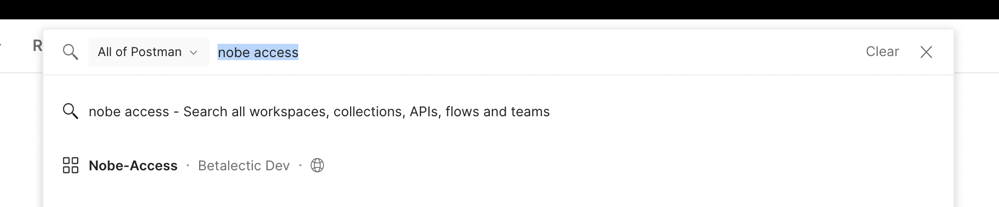

## Intro

Access is a deployed microservice to handle common use-cases around: Authentication, Authorization, Teams and Members, Subscriptions, API Keys, Validating Tokens. It uses JWT Tokens and at this point, doesn't support even Refresh Token.

It is built on and dependent on:

1. NodeJS
2. Postgres

### How to use

- Use postman collection to play with APIs (Workspace ID: 74822521-9125-4c97-8945-cff636e147c0)
- Access image is already published to: https://hub.docker.com/r/nobedocker/access/tags
- You can use this image to run as a container
- You need to provider environment variables (depends on what service you are using to run container like, kubernetes, ecs etc.,)
  - Check .env.example for checking referene
- Create a neptune team, environment and api token
  - All events which need user communication are already sent to Neptune with required payload

### How to find postman collection?

- Search "Nobe access"
- It's available under "Betalectic Dev" Team

### Stories and APIs

- [Register](_docs/Register.md)
- [Login](_docs/Login.md)
- [Password](_docs/Password.md)
- [Update Attributes](_docs/Attributes.md)

### Requests/Bugs/Contribution/Support

- Use Github issues to raise issues
- Use our discord or twitter to reach quickly to us (Visit: https://nobejs.org/)

### License

Coming soon. Mostly MIT. We won't charge. You can fork the code, change it, sell it, use it as you see fit.
